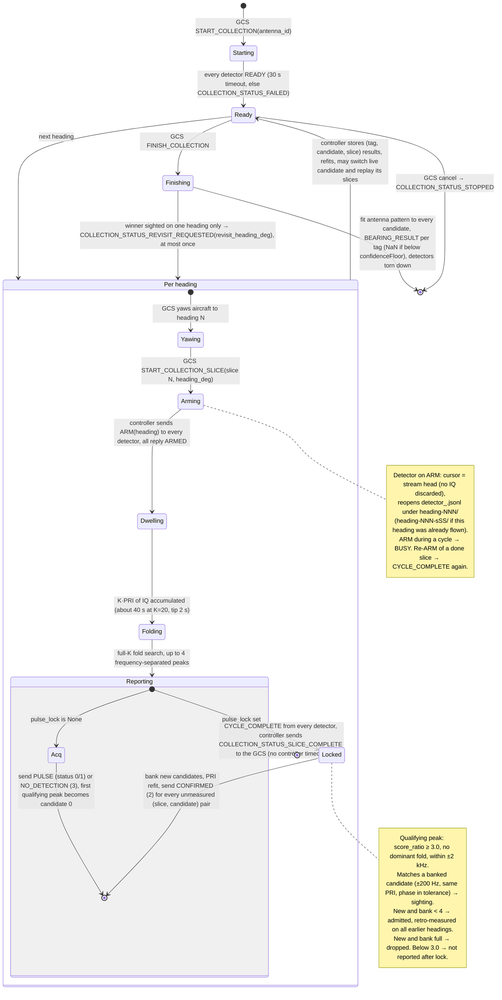

# Collection flow: acquisition → lock → per-slice measurement → bearing

**Scope.** What happens between the GCS pressing "start collection" and
receiving a bearing, as implemented in `detector/pulse_detector.py`,
`detector/collection_control.py`, `controller/CommandHandler.cpp`,
`controller/CollectionCoordinator.cpp` and `controller/BearingCalculator.cpp`.
The per-cycle signal processing inside one dwell is in
[DETECTOR_PIPELINE.md](DETECTOR_PIPELINE.md); the HIGH/LOW confidence
classification is in [CONFIDENCE_PIPELINE.md](CONFIDENCE_PIPELINE.md).

## Actors and channels

```
GCS (TagTracker)
   │  MAVLink tunnel: START_COLLECTION, START_COLLECTION_SLICE, FINISH_COLLECTION
   │                  ← pulse reports, COLLECTION_STATUS, BEARING_RESULT
   ▼
MavlinkTagController2
   │  TTDP over UDP (shared/detector_protocol.h):
   │     → ARM(heading_deg)          ← READY, ARMED, PULSE, NO_DETECTION,
   │                                    CYCLE_COMPLETE, FAILED, HEARTBEAT (1 Hz)
   ▼
pulse_detector.py  (one process per tag, alive for the whole collection)
```

A *collection* is one rotation: the GCS flies N headings (slices), and the
controller ARMs every detector once per slice. Slices are identified by
`(collection_id, slice_id)`; both are echoed in every detector message.

## State machine (one collection)

The GCS drives the rotation one heading at a time; the controller gates each
heading on every detector; the detectors keep state across headings. Each
detector runs the same per-slice cycle regardless of lock state — what changes
after the first qualifying candidate is *what gets reported* (see
[Lock candidates](#lock-candidates)).



An ARM while a cycle is running is answered `BUSY`; a repeated ARM for an
already-completed slice re-sends `CYCLE_COMPLETE` (`collection_control.py`).
Nothing on the control plane clears IQ: an ARM only records the stream index
at which the slice begins (`iq_stream.py`), so a slice starts at the first
sample after the aircraft has settled on the heading.

## Per-slice cycle

Every slice, locked or not, runs the same full-K fold search
(`fold_detect`), so a tag that only becomes visible late in the rotation is
still found. Constants:

| Symbol | Value | Meaning |
| --- | --- | --- |
| `--k` | per tag, from the GCS (`tagInfo.k`; TagTracker default 20) | Folds per cycle; one cycle ≈ K × PRI |
| `ACQUISITION_SEARCH_HZ` | 2000 | Fold search is masked to ±2 kHz around the entered tag offset (`args.freq − center_freq`) |
| `--detection-margin` | 0.90 | Multiplies the EVT threshold down |
| `--confidence-ratio` | 1.3 | `score_ratio` at or above → HIGH (`detection_status` 1), else LOW (0); subject to the dominant-fold gate below |
| `DOMINANT_FOLD_THRESHOLD` | 0.8 | `max_fold_fraction` above → LOW, and ineligible for lock |
| `max_detections` | `MAX_LOCK_CANDIDATES` during a collection, else 1 | Extra peaks feed the candidate bank only; the acquisition report is always the single strongest |

The slice's power spectrogram is appended to `buffered_slices` (a deque of
`MAX_BUFFERED_SLICES` = 64; the oldest is evicted with a warning) together
with its noise estimate, segment start time, heading and a `measured` set of
candidate ids already reported for it.

### Reports in acquisition (no lock yet)

| Outcome | Message | `detection_status` | `confirmed_status` | `candidate_id` |
| --- | --- | --- | --- | --- |
| Strongest peak, `score_ratio ≥ 1.3`, no dominant fold | `PULSE` | 1 SUPERTHRESHOLD | 1 | 0 |
| Strongest peak otherwise | `PULSE` | 0 SUBTHRESHOLD | 0 | 0 |
| Nothing above threshold | `NO_DETECTION` | 3 | 0 | 0 |

followed by `CYCLE_COMPLETE`.

## Lock candidates

**What "lock" does and does not mean.** Nothing is committed to until
`FinishCollection`: every heading still runs the full-K fold search, up to four
qualifying peaks from anywhere in the rotation are banked, each is measured on
every heading, and the controller fits all of them and picks the best. The
"provisional lock" is simply the first qualifying peak (candidate 0). What it
*does* change, from that heading onward, is the report stream: acquisition
reports (status 0/1) stop, and only fixed-coordinate measurements at banked
candidates (status 2) are sent (`pulse_detector.py`, "Post-lock fold results
only feed the candidate bank; they are not reported as acquisition hits").

After the fold search, every peak that satisfies all of

- `score_ratio ≥ --lock-score-ratio` (default **3.0**),
- `max_fold_fraction ≤ DOMINANT_FOLD_THRESHOLD`,
- `|freq − expected_offset| ≤ ACQUISITION_SEARCH_HZ`

is offered to the candidate bank (`admit_lock_candidate`), strongest first.
Two candidates are *the same* (`locks_agree`) when frequency is within
`LOCKED_SEARCH_HZ` = 200 Hz, PRI within one STFT step (`n_ws / fs`), and phase
within `max(n_ws / fs, pri_ppm_uncertainty × |Δt|)` modulo the PRI.

| Bank state | Agreeing entry exists | No agreeing entry, bank not full | Bank full |
| --- | --- | --- | --- |
| Before lock | `merged` (entry replaced by the combined lock, PRI refined from elapsed cycles) | `admitted` | `replaced` — weakest evicted if the newcomer is stronger, else `dropped` |
| After lock | `seen` (sighting recorded; entry untouched) | `admitted` (append) | `dropped` |

`MAX_LOCK_CANDIDATES` = 4. **The first cycle that has any qualifying candidate
locks immediately**: the strongest is moved to index 0 (`promote_to_lock`) and
becomes `pulse_lock`. There is no same-heading confirmation cycle. Once locked,
ids have been reported to the controller, so entries are never renumbered or
evicted — the bank is append-only. Sightings (`{slice_id: score_ratio}` per
candidate) are kept in lockstep with the bank.

### What a later heading's strongest peak becomes, once locked

| Strongest fold peak on a later heading | Outcome |
| --- | --- |
| Agrees with a banked candidate (±200 Hz, same PRI, phase within tolerance) | Recorded as a *sighting* of that candidate; the heading is measured at the candidate's coordinates and reported with `score_ratio` = this peak's fold score ratio |
| Different coordinates, `score_ratio ≥ 3.0`, no dominant fold, bank < 4 | `admitted` as candidate 1–3; measured on this **and every earlier** heading in the same cycle; competes at `FinishCollection` |
| Different coordinates, `score_ratio ≥ 3.0`, bank already 4 | `dropped` — a `LOCK_CANDIDATE dropped` `.jsonl` entry only |
| Different coordinates, `1.0 ≤ score_ratio < 3.0` (would have been a status 0/1 report before lock) | **Not reported.** Only the lock-coordinate measurement of that heading goes out. The peak is still in the `.jsonl` `DETECTION`/`FOLDS` entries for post-flight analysis |

Consequence: if the provisional lock is a false peak, a real tag that only
reaches `score_ratio` 1.3–2.9 on later headings is never banked and is
invisible live; the rotation ends with a rejected or low-`r_squared` bearing.
Raising `score_ratio ≥ 3.0` at K=20 makes a false provisional lock unlikely
(none of the 69 Apr-11 noise detections exceeded 2.55) but the asymmetry is by
design, not an accident of the code.

For a dual-rate collar (`--tip-secondary`) a candidate's PRI is the primary or
secondary TIP according to the winning hypothesis' final rate; reports carry
`rate_state` from `rate_state_for_pri` (see
[RATE_SWITCH_DETECTOR.md](RATE_SWITCH_DETECTOR.md)).

## Locked cycles

Once `pulse_lock` is set, each cycle does, in order:

1. **Fold search at full K** (as above) — new candidates may be appended,
   existing ones get sightings.
2. **PRI refit per candidate** — `fit_lock_timing` re-fits each candidate's
   PRI over *all* buffered slices, searching ±`PRI_FIT_SPAN_PPM` = 300 ppm in
   `PRI_FIT_STEP_PPM` = 2 ppm steps around the nominal, and returns the plateau
   centre with a `pri_ppm_uncertainty` half-width. If the refit would move any
   pulse onto a different STFT window on any buffered slice
   (`pri_refit_moves_pulses`), that candidate's id is removed from every
   slice's `measured` set so they are all re-measured and re-sent. A fit that
   hits the ±300 ppm edge is logged (`pri_fit_clipped`) and not applied.
3. **Measure every unmeasured (slice, candidate) pair** — for each buffered
   slice and each candidate id not yet in its `measured` set,
   `measure_at_lock_psd` sums power at the candidate's frequency over the
   two-window footprint of each projected pulse (from the candidate's anchor
   and PRI), subtracts noise, and divides by the number of pulses that fell
   inside the slice (`per_pulse_power_psd`). This is the fixed-coordinate
   amplitude the bearing fit uses; it does not re-maximise over frequency or
   phase, so it is not floor-compressed the way the acquisition `snr` is (see
   [2026-09_DETECTOR_AMPLITUDE_ANALYSIS.md](../analysis/2026-09_DETECTOR_AMPLITUDE_ANALYSIS.md)).

### Locked measurement report

One `PULSE` per (slice, candidate), with:

| Field | Value |
| --- | --- |
| `detection_status` | 2 CONFIRMED |
| `confirmed_status` | 1 (always, for locked measurements) |
| `candidate_id` | 0 = provisional lock, 1–3 = alternates |
| `group_snr` | `per_pulse_power_psd` — the amplitude the fit uses |
| `snr` | `lock_snr_db` (diagnostic) |
| `score_ratio` (`stft_score` kwarg in `send_pulse_udp`) | fold score ratio of an independent sighting of this candidate on this slice; **0 when the slice was only measured** |
| `noise_psd` | slice noise estimate |
| `collection_id`, `slice_id` | of the *buffered* slice — retro-measurements of earlier headings carry the earlier slice id |
| `rate_state` | A/B by which TIP the candidate's PRI is closer to |

A late candidate is therefore measured on every earlier heading in one cycle
("retro" in the text log; `heading_deg` in the `.jsonl` record names the
heading it was measured at, so the analyzer can re-file it). A failed send
leaves the pair unmeasured and it is retried next cycle.

## Controller side

### Storage and forwarding (`CommandHandler::_handlePythonPulse`)

- Every report during a collection is upserted into `_rotationSlices` keyed by
  `(tag_id, candidate_id, slice_id)`. A detection replaces a no-detection; a
  CONFIRMED measurement replaces an acquisition hit; never the reverse.
  No-detections are kept as censored observations (nulls) for the fit.
- **Outside a collection** every report (0/1/3) is forwarded to the GCS.
- **During a collection** only `detection_status == 2`
  (`CollectionCoordinator::forwardPulseToGcs`) *and* only for the tag's **live
  candidate** (`_liveCandidate`, initially 0).
- After each CONFIRMED report `_updateLiveCandidate` refits every candidate
  (`BearingCalculator::solveCandidates`). Another candidate takes over the live
  view when it has ≥ `kLiveCandidateMinSlices` = 3 measured slices and its
  `r_squared` exceeds the live one's by more than
  `kLiveCandidateSwitchMargin` = 0.15; the controller then replays all of that
  candidate's CONFIRMED slice reports so the GCS display corrects mid-rotation.

### Handshake and timing (`CollectionCoordinator`)

`START_COLLECTION` (carries `antenna_id`, selects the pattern table) →
controller waits up to 30 s for `READY` from every detector, else cancels with
`COLLECTION_STATUS_FAILED`. Per slice: `START_COLLECTION_SLICE` → controller
sends `ARM(heading)` to every detector → each replies `ARMED`, runs its cycle,
sends `CYCLE_COMPLETE` → when the last detector has completed, the controller
sends `COLLECTION_STATUS_SLICE_COMPLETE` to the GCS. There is **no controller
timeout on a slice**; the coordinator stays in `CollectingSlice` until every
detector reports, and a stalled detector is the GCS's to time out. A repeated
`START_COLLECTION_SLICE` for a completed slice replays `SLICE_COMPLETE` without
re-arming.

`FAILED` from a detector is forwarded as `COLLECTION_STATUS_FAILED` with the
detector's error code only if it names the slice currently being collected;
otherwise it is logged and ignored. The controller does not tear the collection
down on its own — the GCS decides whether to cancel.

### `FINISH_COLLECTION`

1. **Revisit check** (before tearing detectors down, since locks and buffers
   live in them): `BearingCalculator::revisitHeadingFor(solve())` — if the
   winning candidate was *sighted* (independent fold detection, `score_ratio >
   0`) on only one heading, the controller replies
   `COLLECTION_STATUS_REVISIT_REQUESTED` with `revisit_heading_deg` at the
   fitted bearing and keeps the collection open. The GCS flies that heading as
   one more slice and finishes again. At most one revisit per collection
   (`_revisitRequested`); a FINISH retry before the slice is armed gets the
   same request again.
2. **Fit** every candidate of every tag (`solveCandidates`): least squares of
   `power(θ) = A·pattern(θ − φ) + B` in **linear power** (`group_snr`) against
   the antenna table (`AntennaPatterns::byId`, 19 points 0–180° at 10°,
   linearly interpolated, folded about 180°). `r_squared` is a composite
   confidence (fit × angular span × degrees-of-freedom factors).
3. **Select** per tag the candidate with the highest `r_squared`, tie-break on
   `n_valid_slices`; it is `rejected` if `r_squared < confidenceFloor` (0.2
   for both RA-2A and RA-23K).
4. **Report** `BEARING_RESULT` per tag: `bearing_deg` (NaN if rejected or never
   locked), `r_squared`, `n_valid_slices`, `best_snr`, `confirmed = !rejected
   && n_sighted_slices ≥ kConfirmedSightings (2)`. If the selected candidate is
   not the one the GCS was following live, its CONFIRMED slice reports are
   replayed first.
5. **Log** `bearing_result.log`
   (`tag_id,bearing_deg,r_squared,n_valid_slices,best_snr,latitude,longitude,n_sighted_slices,confirmed`)
   and `bearing_candidates.log`
   (`tag_id,candidate_id,bearing_deg,confidence,n_valid_slices,best_snr,selected,rejected,n_sighted_slices`)
   in the rotation directory.

## Log artifacts per collection

```
~/Logs/Logs-Rotation-<UTC>/
  MavlinkTagController.log, airspyhf_decimator.log, airspyhf_zeromq_rx.log
  bearing_result.log, bearing_candidates.log
  heading-000/detector_<tag>.jsonl        ← LOCK_CANDIDATE, DETECTION, CANDIDATE_MEASUREMENT,
  heading-045/…                             NO_DETECTION, FOLDS, TIMING entries for that slice
  heading-090-s09/…                       ← a revisit that landed on an already-flown heading
  analysis.md                             ← analyzer/post_flight_analysis.py, run at session stop
```

The `SESSION_END` entry (process-wide totals) is written to whichever heading
file is open when the detector exits.

## Related

- [DETECTOR_PIPELINE.md](DETECTOR_PIPELINE.md) — the per-cycle STFT / fold / EVT processing
- [CONFIDENCE_PIPELINE.md](CONFIDENCE_PIPELINE.md) — HIGH/LOW classification
- [shared/README.md](../../shared/README.md#ttdp-detector-protocol) — TTDP message layout
- [2026-09_DETECTOR_AMPLITUDE_ANALYSIS.md](../analysis/2026-09_DETECTOR_AMPLITUDE_ANALYSIS.md) — why the fixed-offset amplitude and retrospective lock exist
- `detector/tests/test_end_to_end.py`, `test_collection_control.py`, `controller/tests/test_collection_coordinator.cpp`, `test_bearing_calculator.cpp`
