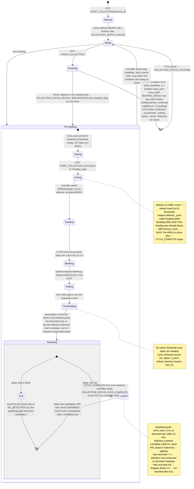

# Collection flow: acquisition → lock → per-slice measurement → bearing

**Scope.** What happens between the GCS pressing "start collection" and
receiving a bearing, as implemented in `detector/pulse_detector.py`,
`detector/collection_control.py`, `controller/CommandHandler.cpp`,
`controller/CollectionCoordinator.cpp` and `controller/BearingCalculator.cpp`.
The per-cycle signal processing inside one dwell is in
[DETECTOR_PIPELINE.md](DETECTOR_PIPELINE.md); the HIGH/LOW confidence
classification is in [CONFIDENCE_PIPELINE.md](CONFIDENCE_PIPELINE.md).

## Actors and channels

```
GCS (TagTracker)
   │  MAVLink tunnel: START_COLLECTION, START_COLLECTION_SLICE, FINISH_COLLECTION
   │                  ← pulse reports, COLLECTION_STATUS, BEARING_RESULT
   ▼
MavlinkTagController2
   │  TTDP over UDP (shared/detector_protocol.h):
   │     → ARM(heading_deg)          ← READY, ARMED, PULSE, NO_DETECTION,
   │                                    CYCLE_COMPLETE, FAILED, HEARTBEAT (1 Hz)
   ▼
pulse_detector.py  (one process per tag, alive for the whole collection)
```

A *collection* is one rotation: the GCS flies N headings (slices), and the
controller ARMs every detector once per slice. Slices are identified by
`(collection_id, slice_id)`; both are echoed in every detector message.

## State machine (one collection)

The GCS drives the rotation one heading at a time; the controller gates each
heading on every detector; the detectors keep state across headings. Each
detector runs the same per-slice cycle regardless of lock state — what changes
after the first qualifying candidate is *what gets reported* (see
[Lock candidates](#lock-candidates)).



An ARM while a cycle is running is answered `BUSY`; a repeated ARM for an
already-completed slice re-sends `CYCLE_COMPLETE` (`collection_control.py`).
Nothing on the control plane clears IQ: an ARM only records the stream index
at which the slice begins (`iq_stream.py`), so a slice starts at the first
sample after the aircraft has settled on the heading.

## Per-slice cycle

Every slice, locked or not, runs the same full-K fold search
(`fold_detect`), so a tag that only becomes visible late in the rotation is
still found. Constants:

| Symbol | Value | Meaning |
| --- | --- | --- |
| `--k` | per tag, from the GCS (`tagInfo.k`; TagTracker default 20) | Folds per cycle; one cycle ≈ K × PRI |
| `USABLE_BAND_FRACTION` | 0.9 | Fold search never enters the decimator's transition band: bins beyond 0.9 × fs/2 (±1728 Hz) are masked out |
| `ACQUISITION_SEARCH_HZ` | 2000 | Fold search is further masked to ±2 kHz around the entered tag offset (`args.freq − center_freq`) |
| `--detection-margin` | 1.0 | Multiplies the per-dwell permutation-null threshold (DETECTOR_PIPELINE.md §6); 1.0 = the threshold is `pf` |
| `--null-permutations` | 40 | Window permutations per cycle for the null |
| `--confidence-ratio` | 1.3 | `score_ratio` at or above → HIGH (`detection_status` 1), else LOW (0); subject to the dominant-fold gate below |
| `DOMINANT_FOLD_THRESHOLD` | 0.8 | `max_fold_fraction` above → LOW, and ineligible for lock |
| `max_detections` | `MAX_LOCK_CANDIDATES` during a collection, else 1 | Extra peaks feed the candidate bank only; the acquisition report is always the single strongest |

The slice's power spectrogram is appended to `buffered_slices` (a deque of
`MAX_BUFFERED_SLICES` = 64; the oldest is evicted with a warning) together
with its noise estimate, segment start time, heading and a `measured` set of
candidate ids already reported for it.

### Reports in acquisition (no lock yet)

| Outcome | Message | `detection_status` | `confirmed_status` | `candidate_id` |
| --- | --- | --- | --- | --- |
| Strongest peak, `score_ratio ≥ 1.3`, no dominant fold | `PULSE` | 1 SUPERTHRESHOLD | 1 | 0 |
| Strongest peak otherwise | `PULSE` | 0 SUBTHRESHOLD | 0 | 0 |
| Nothing above threshold | `NO_DETECTION` | 3 | 0 | 0 |

followed by `CYCLE_COMPLETE`.

## Lock candidates

**What "lock" does and does not mean.** Nothing is committed to until
`FinishCollection`: every heading still runs the full-K fold search, up to four
qualifying peaks from anywhere in the rotation are banked, each is measured on
every heading, and the controller fits all of them and picks the best. The
"provisional lock" is simply the first qualifying peak (candidate 0). What it
*does* change, from that heading onward, is the report stream: acquisition
reports (status 0/1) stop, and only fixed-coordinate measurements at banked
candidates (status 2) are sent (`pulse_detector.py`, "Post-lock fold results
only feed the candidate bank; they are not reported as acquisition hits").

After the fold search, every peak that satisfies all of

- `score_ratio ≥ --lock-score-ratio` (default **3.0**),
- `max_fold_fraction ≤ DOMINANT_FOLD_THRESHOLD`,
- `|freq − expected_offset| ≤ ACQUISITION_SEARCH_HZ`

is offered to the candidate bank (`admit_lock_candidate`), strongest first.
Two candidates are *the same* (`locks_agree`) when frequency is within
`LOCKED_SEARCH_HZ` = 200 Hz, PRI within one STFT step (`n_ws / fs`), and phase
within `max(LOCK_PHASE_TOLERANCE_STEPS × n_ws / fs, pri_ppm_uncertainty × |Δt|)`
modulo the PRI. The floor is two steps: a fresh fold anchor is a window index
(rounded, and up to one window early from local-max pooling) while the banked
anchor has been refit to a fraction of a step, so the same train can differ
by ~1.5 steps.

| Bank state | Agreeing entry exists | No agreeing entry, bank not full | Bank full |
| --- | --- | --- | --- |
| Before lock | `merged` (entry replaced by the combined lock, PRI refined from elapsed cycles) | `admitted` | `replaced` — weakest evicted if the newcomer is stronger, else `dropped` |
| After lock | `seen` (sighting recorded; entry untouched) | `reanchored` if an entry has the same frequency and PRI but its projected phase missed (entry's anchor moved to this sighting, sighting recorded, every buffered slice re-measured at it); otherwise `admitted` (append) | `dropped` |

`MAX_LOCK_CANDIDATES` = 4. **The first cycle that has any qualifying candidate
locks immediately**: the strongest is moved to index 0 (`promote_to_lock`) and
becomes `pulse_lock`. There is no same-heading confirmation cycle. Once locked,
ids have been reported to the controller, so entries are never renumbered or
evicted — the bank is append-only. Sightings (`{slice_id: score_ratio}` per
candidate) are kept in lockstep with the bank.

### What a later heading's strongest peak becomes, once locked

| Strongest fold peak on a later heading | Outcome |
| --- | --- |
| Agrees with a banked candidate (±200 Hz, same PRI, phase within tolerance) | Recorded as a *sighting* of that candidate; the heading is measured at the candidate's coordinates and reported with `score_ratio` = this peak's fold score ratio |
| Same frequency and PRI as a banked candidate but phase outside tolerance | `reanchored`: one emitter cannot occupy one bin at one PRI twice, so the candidate's anchor is moved to this peak, the sighting is recorded against it, and every buffered heading is re-measured at the new timing (the next PRI refit starts from the new anchor). Seen on the 2026-09-12 `moderate` run when a two-dwell PRI fit was ~90 ppm off and the tag was re-admitted as a duplicate |
| Different coordinates, `score_ratio ≥ 3.0`, no dominant fold, bank < 4 | `admitted` as candidate 1–3; measured on this **and every earlier** heading in the same cycle; competes at `FinishCollection` |
| Different coordinates, `score_ratio ≥ 3.0`, bank already 4 | `dropped` — a `LOCK_CANDIDATE dropped` `.jsonl` entry only |
| Different coordinates, `1.0 ≤ score_ratio < 3.0` (would have been a status 0/1 report before lock) | **Not reported.** Only the lock-coordinate measurement of that heading goes out. The peak is still in the `.jsonl` `DETECTION`/`FOLDS` entries for post-flight analysis |

Consequence: if the provisional lock is a false peak, a real tag that only
reaches `score_ratio` 1.3–2.9 on later headings is never banked and is
invisible live; the rotation ends with a rejected or low-`r_squared` bearing.
Raising `score_ratio ≥ 3.0` at K=20 makes a false provisional lock unlikely
(none of the 69 Apr-11 noise detections exceeded 2.55) but the asymmetry is by
design, not an accident of the code.

For a dual-rate collar (`--tip-secondary`) a candidate's PRI is the primary or
secondary TIP according to the winning hypothesis' final rate; reports carry
`rate_state` from `rate_state_for_pri` (see
[RATE_SWITCH_DETECTOR.md](RATE_SWITCH_DETECTOR.md)).

## Locked cycles

Once `pulse_lock` is set, each cycle does, in order:

1. **Fold search at full K** (as above) — new candidates may be appended,
   existing ones get sightings.
2. **PRI refit per candidate** — `fit_lock_timing` re-fits each candidate's
   PRI over *all* buffered slices, searching ±`PRI_FIT_SPAN_PPM` = 300 ppm in
   `PRI_FIT_STEP_PPM` = 2 ppm steps around the nominal, jointly with the
   anchor's offset over ±one STFT step (the anchor comes from a fold window
   index, so it is quantised and may sit a window early; held fixed it would
   tilt the PRI by hundreds of ppm over one dwell). It sums on-pulse
   power over the four windows a pulse touches at 50 % overlap (half, full,
   full, half) — wider than the two-window measurement footprint, because a
   two-window sum over that symmetric response scores a whole-step alias of
   the PRI as well as the truth. It returns the plateau centre with a
   `pri_ppm_uncertainty` half-width that is never below what the fitted span
   can resolve, `one STFT step / longest lever arm from the anchor` (≈ 250 ppm
   after one dwell, ≈ 100 after two, ≈ 25 after eight); `locks_agree` scales
   its phase tolerance by this, so a candidate is not re-admitted as a
   duplicate because an early, loosely constrained fit was trusted too far. Hypotheses
   that kept fewer than half the windows of the best-covered one (gaps,
   segment edges) cannot win. If the refit would move any
   pulse onto a different STFT window on any buffered slice
   (`pri_refit_moves_pulses`), that candidate's id is removed from every
   slice's `measured` set so they are all re-measured and re-sent. A fit that
   hits the ±300 ppm edge is logged (`pri_fit_clipped`) and not applied.
3. **Measure every unmeasured (slice, candidate) pair** — for each buffered
   slice and each candidate id not yet in its `measured` set,
   `measure_at_lock_psd` sums power at the candidate's frequency over the
   two-window footprint of each projected pulse (from the candidate's anchor
   and PRI), subtracts noise, and divides by the number of pulses that fell
   inside the slice (`per_pulse_power_psd`). This is the fixed-coordinate
   amplitude the bearing fit uses; it does not re-maximise over frequency or
   phase, so it is not floor-compressed the way the acquisition `snr` is (see
   [2026-09_DETECTOR_AMPLITUDE_ANALYSIS.md](../analysis/2026-09_DETECTOR_AMPLITUDE_ANALYSIS.md)).

### Locked measurement report

One `PULSE` per (slice, candidate), with:

| Field | Value |
| --- | --- |
| `detection_status` | 2 CONFIRMED |
| `confirmed_status` | 1 (always, for locked measurements) |
| `candidate_id` | 0 = provisional lock, 1–3 = alternates |
| `group_snr` | `per_pulse_power_psd` — the amplitude the fit uses |
| `snr` | `lock_snr_db` (diagnostic) |
| `score_ratio` (`stft_score` kwarg in `send_pulse_udp`) | fold score ratio of an independent sighting of this candidate on this slice; **0 when the slice was only measured** |
| `noise_psd` | slice noise estimate |
| `collection_id`, `slice_id` | of the *buffered* slice — retro-measurements of earlier headings carry the earlier slice id |
| `rate_state` | A/B by which TIP the candidate's PRI is closer to |

A late candidate is therefore measured on every earlier heading in one cycle
("retro" in the text log; `heading_deg` in the `.jsonl` record names the
heading it was measured at, so the analyzer can re-file it). A failed send
leaves the pair unmeasured and it is retried next cycle.

## Controller side

### Storage and forwarding (`CommandHandler::_handlePythonPulse`)

- Every report during a collection is upserted into `_rotationSlices` keyed by
  `(tag_id, candidate_id, slice_id)`. A detection replaces a no-detection; a
  CONFIRMED measurement replaces an acquisition hit; never the reverse.
  No-detections are kept as censored observations (nulls) for the fit.
- **Outside a collection** every report (0/1/3) is forwarded to the GCS.
- **During a collection** only `detection_status == 2`
  (`CollectionCoordinator::forwardPulseToGcs`) *and* only for the tag's **live
  candidate** (`_liveCandidate`, initially 0).
- After each CONFIRMED report `_updateLiveCandidate` refits every candidate
  (`BearingCalculator::solveCandidates`). Another candidate takes over the live
  view when it has ≥ `kLiveCandidateMinSlices` = 3 measured slices and its
  `r_squared` exceeds the live one's by more than
  `kLiveCandidateSwitchMargin` = 0.15; the controller then replays all of that
  candidate's CONFIRMED slice reports so the GCS display corrects mid-rotation.

### Handshake and timing (`CollectionCoordinator`)

`START_COLLECTION` (carries `antenna_id`, selects the pattern table) →
controller waits up to 30 s for `READY` from every detector, else cancels with
`COLLECTION_STATUS_FAILED`. Per slice: `START_COLLECTION_SLICE` → controller
sends `ARM(heading)` to every detector → each replies `ARMED`, runs its cycle,
sends `CYCLE_COMPLETE` → when the last detector has completed, the controller
sends `COLLECTION_STATUS_SLICE_COMPLETE` to the GCS. There is **no controller
timeout on a slice**; the coordinator stays in `CollectingSlice` until every
detector reports, and a stalled detector is the GCS's to time out. A repeated
`START_COLLECTION_SLICE` for a completed slice replays `SLICE_COMPLETE` without
re-arming.

`FAILED` from a detector is forwarded as `COLLECTION_STATUS_FAILED` with the
detector's error code only if it names the slice currently being collected;
otherwise it is logged and ignored. The controller does not tear the collection
down on its own — the GCS decides whether to cancel.

### `FINISH_COLLECTION`

1. **Revisit check** (before tearing detectors down, since locks and buffers
   live in them): `BearingCalculator::revisitHeadingFor(solve())` — if the
   winning candidate was *sighted* (independent fold detection, `score_ratio >
   0`) on only one heading, the controller replies
   `COLLECTION_STATUS_REVISIT_REQUESTED` with `revisit_heading_deg` at the
   fitted bearing and keeps the collection open. The GCS flies that heading as
   one more slice and finishes again. At most one revisit per collection
   (`_revisitRequested`); a FINISH retry before the slice is armed gets the
   same request again.
2. **Fit** every candidate of every tag (`solveCandidates`): weighted least
   squares of `power(θ) = A·pattern(θ − φ) + B` in **linear power**
   (`signal_psd`) against the antenna table (`AntennaPatterns::byId`, 19 points
   0–180° at 10°, linearly interpolated, folded about 180°). Each detected
   heading is weighted by the inverse variance of its measurement, which for a
   K-pulse noise-subtracted mean scales as `1 / noise_psd_i²`; weights are
   expressed relative to the median heading, `w_i = (median noise_psd /
   noise_psd_i)²`, so a heading with an invalid `noise_psd` gets weight 1 and K
   (taken as common to all slices) cancels; a gap-clipped slice that averaged
   fewer pulses is over-weighted by `K/n` (#153). Headings near the floor
   therefore inform the fit without dominating it. `r_squared` is a composite confidence
   (weighted fit × angular span × degrees-of-freedom factors). Per-heading
   residuals are kept on the result for diagnostics.
3. **Select** per tag the candidate with the highest `r_squared`. A
   candidate that clears `confidenceFloor` always beats one that does not,
   so the tie-break below can never trade a valid bearing for a rejection.
   Otherwise, candidates
   within `kCandidateConfidenceTolerance` = 0.05 of each other are not
   separated by the fit (two candidates measuring the same pulses — a
   duplicate lock, a sidelobe image — differ by well under 0.01 from noise
   alone, a flat interferer against a pattern-shaped tag by tenths); among
   those the one with more *sighted* slices wins, then more detected slices,
   then higher `best_snr`. The selected candidate is `rejected` if
   `r_squared < confidenceFloor` (0.2
   for both RA-2A and RA-23K).
4. **Report** `BEARING_RESULT` per tag. Three outcomes share the existing
   fields:
   - *Bearing*: finite `bearing_deg`, `r_squared`, `n_valid_slices`,
     `best_snr`, `confirmed = n_sighted_slices ≥ kConfirmedSightings (2)`.
   - *Heard, no bearing*: `bearing_deg` NaN, `r_squared` 0, `n_valid_slices`
     > 0. Either the selected lock fell below the confidence floor, or the
     tag **never locked** and its acquisition hits (`score_ratio` 1–3,
     `detection_status` 0/1) agree in frequency: at least
     `kHeardMinAgreeingHits` = 2 within `kHeardFrequencyToleranceHz` = 200 Hz
     of one another. Acquisition hits alone never produce a bearing: each is
     inside the per-heading false-alarm rate and three of them near threshold
     do not constrain the pattern fit (2026-09-12 `below-marginal` run: 117°
     for a tag at 135°). Two in one bin on different headings is ~1e-3 per
     rotation from noise, so agreement in frequency is what separates "heard"
     from "nothing".
   - *Nothing heard*: `bearing_deg` NaN, `n_valid_slices` 0, `best_snr` 0 —
     no detections, or scattered acquisition hits that do not agree.
   If the selected candidate is not the one the GCS was following live, its
   CONFIRMED slice reports are replayed first.
5. **Log** `bearing_result.log`
   (`tag_id,bearing_deg,r_squared,n_valid_slices,best_snr,latitude,longitude,n_sighted_slices,confirmed,heard`)
   and `bearing_candidates.log`
   (`tag_id,candidate_id,bearing_deg,confidence,n_valid_slices,best_snr,selected,rejected,n_sighted_slices,residuals`;
   `residuals` is `;`-separated `heading:residual:weight` per detected heading,
   residual = `measured − fitted` power)
   in the rotation directory.
6. **Replay on retry.** The candidate replays, `BEARING_RESULT`s and the final
   `COLLECTION_STATUS_STOPPED` have no ACK of their own, so every frame the
   finalize pushed is kept (`_lastFinishOutcome`, keyed by `collection_id`;
   a `REVISIT_REQUESTED` answer is kept the same way). A
   `FINISH_COLLECTION` for an already-finished id (`CollectionCoordinator`
   `Duplicate`) re-sends those frames before ACKing; a byte-identical retry
   (same `request_id`) replays them through a replay-only path before its
   cached ACK, so a late retry can never finalize or cancel anything. A
   cached-success `START_COLLECTION_SLICE` retry likewise re-runs the slice
   handler, whose `Duplicate` / `AlreadyComplete` paths re-send `SLICE_ARMED`
   / `SLICE_COMPLETE`.
   On the GCS,
   `PythonWaitForFinishOutcomeState` re-enters the FINISH send state (new
   `request_id`) when neither outcome arrives within 5 s, up to 2 times, and
   only then aborts the rotation.

On the GCS the finite/NaN bearing, `n_valid_slices` and `confirmed` flag
become one of four operator-facing states — *confirmed*, *unconfirmed* (lock
seen on one heading only), *heard, no bearing* (NaN with `n_valid_slices` > 0),
*nothing heard* (NaN with `n_valid_slices` = 0) — plus the 45° rose sector the
bearing falls in; the sector is derived from `bearing_deg` and the flown slice
count, nothing extra is carried on the wire.

## Simulator levels

`--simulator <level>` with a configured tag drives this flow end to end
(levels and SNRs: [simulator/README.md](../../simulator/README.md#controller-signal-levels)).
The SNRs were chosen around the detector's `--lock-score-ratio` of 3.0 at
K=20; the per-dwell permutation-null threshold
([DETECTOR_PIPELINE.md](DETECTOR_PIPELINE.md)) moves the exact `score_ratio`
each level produces, so the outcomes below are the intent to verify, not a
guarantee. The transmitter sits at 135°; with TagTracker's clockwise sweep
from 0° that is the fourth heading, so the first three headings are always
measured retrospectively once a lock exists.

- **`strong`** (20 dB): locks on the first heading that sees the tag (0° is
  45° off-axis, still tens of dB up); sighted on every heading → *confirmed*,
  sector 3, bearing ≈ 135°. The tag is 50–70 dB over noise, so its spectral
  sidelobe images are admitted as extra candidates (#148).
- **`moderate`** (−8 dB): sighted on every heading (deepest pattern null
  still ≈ 20 dB over noise) → *confirmed*, bearing ≈ 135°, one candidate, no
  sidelobe images.
- **`marginal`** (−27 dB): sighted on one heading only (135°, `score_ratio`
  ≈ 5 against the lock ratio 3; ±45° ≈ 2, below it). `FINISH_COLLECTION`
  returns `COLLECTION_STATUS_REVISIT_REQUESTED`, the GCS flies that heading
  again, then *confirmed* if the revisit sights it, otherwise *unconfirmed*.
  −21 dB gave three sightings and a confirm without a revisit.
- **`below-marginal`** (−33 dB): never locks (best `score_ratio` ≈ 1.6 at
  135°) but the tag's bin clears the `pf` threshold on the two or three
  headings nearest 135°. No bearing is fitted from such hits; because they
  agree in frequency the result is *heard, no bearing* (`bearing_deg` NaN,
  `n_valid_slices` > 0).
- **`silent`**: `noise-only` preset. No lock, `mu` ≈ 68 on every heading
  (`refined: true` on some — the strongest noise bin passing the train gate —
  without moving `threshold`), at most a few scattered `pf` hits (≈ 0.4 per
  rotation) → *nothing heard* (`bearing_deg` NaN, `n_valid_slices` 0). Two
  noise hits in one bin would wrongly read as *heard*; ~1e-3 per rotation.
- **`competing`** (−18 dB tag, flat −18 dB tone at +1 kHz): the interferer
  takes the provisional lock (candidate 0) on the first heading; the tag is
  admitted as an alternate near 135°; every buffered heading is measured at
  both; the finish-time fit must select the tag (pattern-shaped) over the
  interferer (flat).
- **`power-line`** (−8 dB tag, directional Gaussian source +15 dB at
  boresight, bearing 270°, seen through the antenna pattern): the source adds
  to the base noise, so the combined floor is ≈ 15 dB up at 270°, ≈ 11–12 dB
  at 225°/315° (45° off the source is −3.75 dB on the RA-2A table), ≈ 6 dB at
  90° (back lobe) and near the base floor where the pattern nulls it
  (`cycle_threshold.mu` and `threshold` stay ≈ 68–75 throughout; the noise
  PSD column in `analysis.md` shows the swing), with no false detections. The
  bearing fit down-weights the noisy headings (`bearing_candidates.log`
  weights ≪ 1 at 225–315°) and the result stays *confirmed* at ≈ 135°.
  `--sim-noise-source-impulsive` makes the source heavy-tailed (Student-t) to
  exercise `--detector-impulse-blank-factor`.

## Log artifacts per collection

```
~/Logs/Logs-Rotation-<UTC>/
  MavlinkTagController.log, airspyhf_decimator.log, airspyhf_zeromq_rx.log
  bearing_result.log, bearing_candidates.log
  heading-000/detector_<tag>.jsonl        ← LOCK_CANDIDATE, DETECTION, CANDIDATE_MEASUREMENT,
  heading-045/…                             NO_DETECTION, FOLDS, TIMING entries for that slice
  heading-090-s09/…                       ← a revisit that landed on an already-flown heading
  analysis.md                             ← analyzer/post_flight_analysis.py, run at session stop
```

The `SESSION_END` entry (process-wide totals) is written to whichever heading
file is open when the detector exits.

## Related

- [DETECTOR_PIPELINE.md](DETECTOR_PIPELINE.md) — the per-cycle STFT / fold / threshold processing
- [CONFIDENCE_PIPELINE.md](CONFIDENCE_PIPELINE.md) — HIGH/LOW classification
- [shared/README.md](../../shared/README.md#ttdp-detector-protocol) — TTDP message layout
- [2026-09_DETECTOR_AMPLITUDE_ANALYSIS.md](../analysis/2026-09_DETECTOR_AMPLITUDE_ANALYSIS.md) — why the fixed-offset amplitude and retrospective lock exist
- `detector/tests/test_end_to_end.py`, `test_collection_control.py`, `controller/tests/test_collection_coordinator.cpp`, `test_bearing_calculator.cpp`
